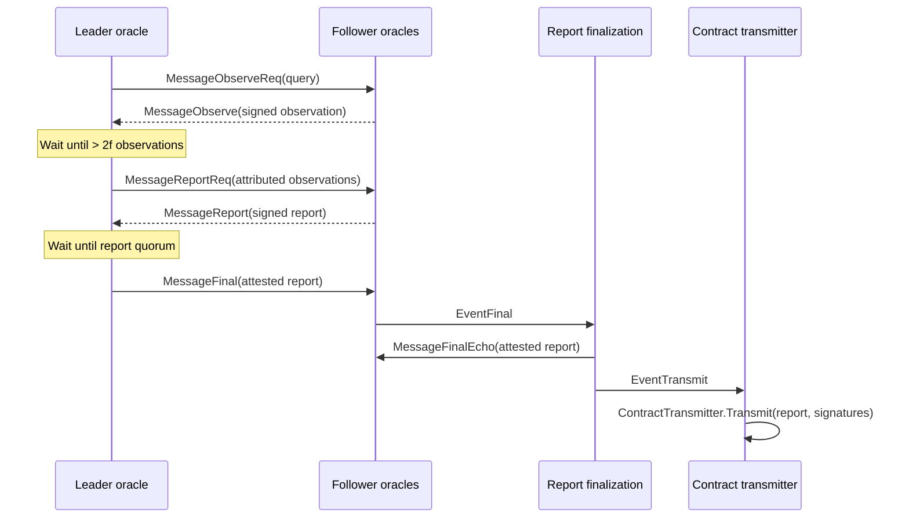
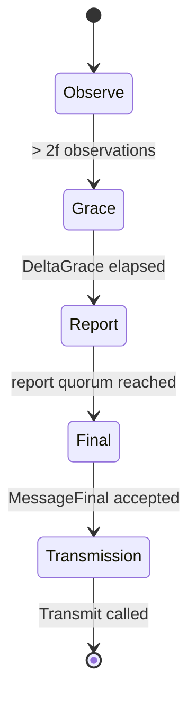

# OCR2 Protocol Walkthrough

This document is a high-level guide to a single OCR2 report generation and
transmission flow. It is meant as a visual starting point for readers who want
to connect the protocol messages to the implementation files.

For protocol details and edge cases, refer to the OCR whitepapers listed in the
repository README.

## Flow



At a high level:

1. The leader requests observations from all oracles.
2. Each oracle observes application-specific data and signs its observation
   offchain.
3. The leader verifies the signed observations and waits for more than `2f`
   observations.
4. The leader broadcasts the attributed observations and asks oracles to
   construct a report.
5. Oracles construct and sign the report.
6. The leader waits for report quorum and broadcasts a finalized attested
   report.
7. Report finalization emits a transmission event.
8. The transmission protocol calls `ContractTransmitter.Transmit`.

## Leader Phases



These phases correspond to the `phaseObserve`, `phaseGrace`, `phaseReport`,
and `phaseFinal` states in the OCR2 report generation leader implementation.

## Code Map

| Step | File | Function |
| --- | --- | --- |
| Start a leader round | `offchainreporting2plus/internal/ocr2/protocol/report_generation_leader.go` | `startRound` |
| Handle an observation request | `offchainreporting2plus/internal/ocr2/protocol/report_generation_follower.go` | `messageObserveReq` |
| Sign an observation | `offchainreporting2plus/internal/ocr2/protocol/observation.go` | `MakeSignedObservation` |
| Verify observations at the leader | `offchainreporting2plus/internal/ocr2/protocol/report_generation_leader.go` | `messageObserve` |
| Enter the report phase | `offchainreporting2plus/internal/ocr2/protocol/report_generation_leader.go` | `eventTGraceTimeout` |
| Build and sign a report | `offchainreporting2plus/internal/ocr2/protocol/report_generation_follower.go` | `messageReportReq` |
| Collect report signatures | `offchainreporting2plus/internal/ocr2/protocol/report_generation_leader.go` | `messageReport` |
| Finalize an attested report | `offchainreporting2plus/internal/ocr2/protocol/report_finalization.go` | `finalize` |
| Decide whether to transmit | `offchainreporting2plus/internal/ocr2/protocol/transmission.go` | `eventTransmit` |
| Transmit the report | `offchainreporting2plus/internal/ocr2/protocol/transmission.go` | `eventTTransmitTimeout` |

## Reporting Plugin Callbacks

OCR2 handles networking, signatures, quorum, finalization, and transmission.
Application-specific behavior lives behind the `ReportingPlugin` interface in
`offchainreporting2plus/types/types.go`.

During a successful round, these callbacks are typically involved:

| Callback | Purpose |
| --- | --- |
| `Query` | Creates the query sent by the leader in `MessageObserveReq`. |
| `Observation` | Reads application-specific data and returns an observation. |
| `Report` | Builds the report from attributed observations. |
| `ShouldAcceptFinalizedReport` | Decides whether a finalized report should enter the local transmission schedule. |
| `ShouldTransmitAcceptedReport` | Runs immediately before `ContractTransmitter.Transmit`. |

## Minimal Message Path

The happy path for one OCR2 round can be read as:

```text
MessageObserveReq
MessageObserve
MessageReportReq
MessageReport
MessageFinal
EventFinal
MessageFinalEcho
EventTransmit
ContractTransmitter.Transmit
```

The real implementation includes additional handling for timeouts, leader
changes, persistence, duplicate messages, malformed messages, and Byzantine
faults. Those paths are intentionally omitted here so this walkthrough can stay
focused on the core report path.
